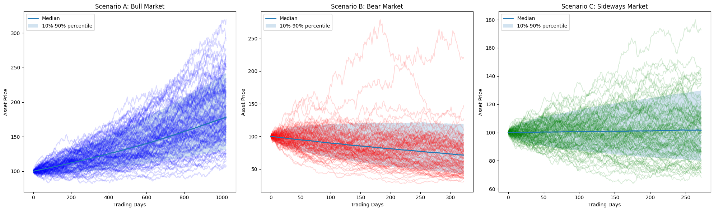
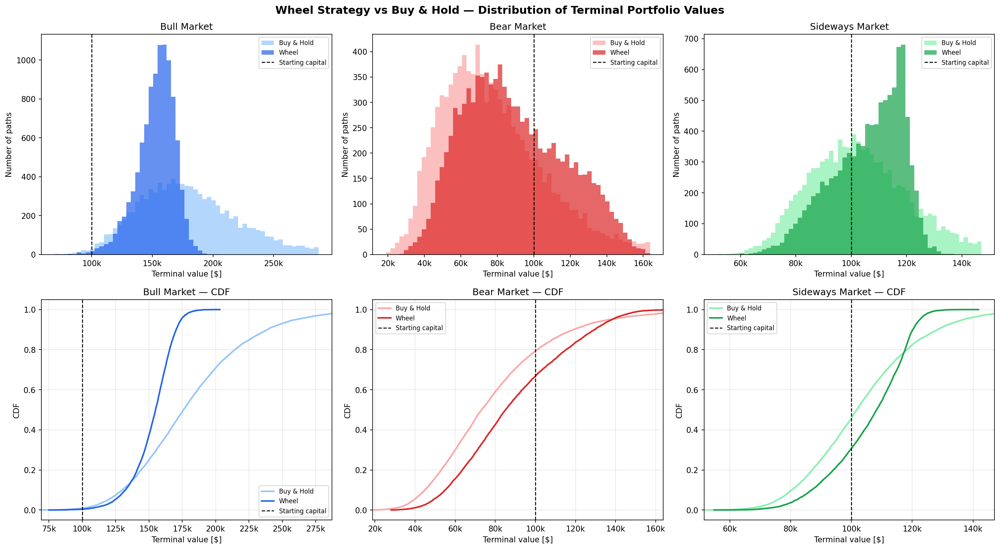

# The Options Wheel vs. Buy & Hold — A Monte Carlo Study Across Market Regimes


[](https://your-app.streamlit.app)

A simulation study that asks a simple question: **does systematically selling option
premium (the "Wheel") actually beat just holding the asset?** Both strategies are run on
the *same* 10,000 simulated price paths in each of three market regimes — a bull, a bear,
and a sideways market — so the comparison is paired path-by-path rather than a comparison
of two separate experiments.

The short answer is nuanced, and that nuance is the point. The Wheel does **not** maximise
expected wealth. What it does, across every regime tested, is reshape the *distribution* of
outcomes — shallower drawdowns, a thinner left tail, and a higher risk-adjusted return —
at the cost of giving up the right tail in a strong bull market. It is best read as a tool
for **managing volatility**, not for chasing return.

> This project was presented at the **14th Kraków Conference on Financial Mathematics**
> (*XIV Krakowska Konferencja Matematyki Finansowej*), 9 May 2026.

---

## Table of contents

- [Motivation](#motivation)
- [What the Wheel is](#what-the-wheel-is)
- [Methodology](#methodology)
  - [Market model: geometric Brownian motion](#market-model-geometric-brownian-motion)
  - [The three regimes](#the-three-regimes)
  - [Monte Carlo design](#monte-carlo-design)
  - [Option pricing and the analytical strike](#option-pricing-and-the-analytical-strike)
  - [Implied volatility and the volatility risk premium](#implied-volatility-and-the-volatility-risk-premium)
- [Performance and risk metrics](#performance-and-risk-metrics)
- [Results](#results)
- [Key findings](#key-findings)
- [Assumptions and limitations](#assumptions-and-limitations)
- [Repository structure](#repository-structure)
- [Interactive app](#interactive-app)
- [Reproducing the study](#reproducing-the-study)
- [Reading the results responsibly](#reading-the-results-responsibly)

---

## Motivation

Selling options is often marketed as a way to "generate income" from a portfolio, with the
implicit promise of higher returns and lower risk at the same time. That framing is too
good to be true, and the interesting question is what the trade-off *actually* looks like.

Selling a put or a call hands away the tails of the return distribution in exchange for a
premium received up front. A premium seller is, in effect, short volatility: the position
profits when realised moves are small and loses when they are large. There is a well-known
structural reason a seller can be compensated for this — the **volatility risk premium
(VRP)**, the empirical tendency for options to be priced at an implied volatility slightly
above the volatility that subsequently realises. Buyers pay up for insurance; sellers
collect the spread.

This study isolates that mechanic in a controlled, simulated environment and measures its
consequences. **Buy & Hold** is the benchmark — buy the asset on day one, hold to the end.
The **Wheel** is the systematic premium-selling strategy described below. The same
simulated price paths feed both, and the question is not only *which earns more on average*
but *how the whole distribution of outcomes differs*, regime by regime.

---

[View Presentation (PDF)](Options_strategy_wheel_vs_Buy_paper_from_kkmf.pdf) (PL)
[View code (python notebook)](PL_wheel_strategy_risk_analysis_mc.ipynb) (PL)

---

## What the Wheel is

The Wheel is a cyclical, rules-based strategy that alternates between selling cash-secured
puts and selling covered calls. One full turn of the wheel:

1. **Sell a cash-secured put.** Collect the premium. Hold enough cash to buy the shares if
   assigned.
2. **Get assigned (if the put expires in-the-money).** Buy 100 shares per contract at the
   strike — i.e. acquire the asset at a discount to the price when the put was sold, net of
   premium.
3. **Sell a covered call against the shares.** Collect more premium, which keeps lowering
   the effective cost basis.
4. **Get called away (if the call expires in-the-money).** Sell the shares at the strike,
   booking the gain, and return to step 1.

If a sold option expires out-of-the-money, no shares change hands and the same leg is simply
re-sold — premium keeps accruing while the position waits. The decision rules used here are
deliberately mechanical, so that the simulation tests the *strategy* and not a trader's
discretion:

- **Strike selection by delta.** Each option is written at an absolute delta of
  **|Δ| = 0.30** — roughly a 30%-ish chance of finishing in-the-money under the model. This
  fixes how aggressively the strategy reaches for premium versus how often it gets assigned.
- **Tenor.** Every option is **21 observation steps** to expiry, then rolled.
- **Cost-basis protection on the call leg.** When selling the covered call, the strike is
  set to `K = max(K_assigned, K_Δ)` — never below the price at which the shares were
  acquired. This stops the strategy from being forced to sell its stock at a loss just to
  collect a call premium.

---

## Methodology

### Market model: geometric Brownian motion

Each price path is a geometric Brownian motion (GBM). The asset follows

```
dS_t = μ S_t dt + σ S_t dW_t
```

which is simulated with the exact log-Euler discretisation (no discretisation bias):

```
S_{t+Δt} = S_t · exp[ (μ − ½σ²)·Δt + σ·√Δt · Z ],   Z ~ N(0, 1)
```

with `Δt = 1/252` (252 trading days per year). Paths are generated in a fully vectorised
way: a matrix of standard-normal shocks is drawn once and turned into prices with a single
cumulative product, so a 10,000-path scenario is one NumPy operation rather than a Python
loop.



*A sample of GBM paths in each regime, with the median and the 10th–90th percentile band.
The bull market drifts up with a fanning cone of outcomes; the bear market drifts down under
high volatility; the sideways market stays anchored near its starting level.*

### The three regimes

The three scenarios are **stylised** — they are not calibrated to one specific ETF, but
chosen to span qualitatively different environments and stress the strategy in each.

| Regime          | Drift μ | Volatility σ | Horizon (active trading days) |
| --------------- | :-----: | :----------: | :---------------------------: |
| **Bull**        |  +15%   |     12%      |        ≈ 1000 (≈ 4.0 yr)      |
| **Bear**        |  −20%   |     35%      |        ≈ 300  (≈ 1.2 yr)      |
| **Sideways**    |   +3%   |     18%      |        ≈ 250  (≈ 1.0 yr)      |

### Monte Carlo design

- **10,000 paths per regime.**
- **Starting capital: \$100,000.** Buy & Hold deploys it all on the first active day; the
  Wheel uses it as collateral for cash-secured puts.
- **Risk-free rate r = 4%.** Idle cash in the Wheel earns this rate, compounded daily, while
  positions are open — so the comparison is not unfairly tilted by leaving the Wheel's cash
  inert.
- **A 22-step warm-up.** Both strategies start trading on day 22. The warm-up exists so the
  trailing-volatility estimator (below) is populated with history before the first option is
  written.
- **Paired comparison.** Every path is fed to *both* strategies. This is what makes
  `P(Wheel > Buy & Hold)` meaningful: it is the fraction of identical-market scenarios in
  which the Wheel's terminal wealth beats Buy & Hold's, not a comparison of two unrelated
  distributions.
- **Reproducible.** A fixed random seed makes every figure and number in this README
  exactly reproducible.

### Option pricing and the analytical strike

Options are priced with the **Black–Scholes** model for European puts and calls. Rather than
searching numerically for the strike that yields a 0.30-delta option, the code **inverts the
delta in closed form**. Because a call's delta is `N(d₁)`, a target delta pins down `d₁`
directly, and the strike follows analytically:

```
d₁ = N⁻¹(Δ_call)
K  = S · exp[ −d₁·σ·√T + (r + ½σ²)·T ]
```

This gives the exact target-delta strike in one step, with no root-finding — a small but
clean efficiency that keeps the per-path inner loop fast.

### Implied volatility and the volatility risk premium

The premium a seller collects depends entirely on the implied volatility used to price the
option. Here, implied volatility is modelled as the asset's **trailing 21-day realised
volatility plus a constant 2% (200 bps) volatility risk premium**:

```
IV_t = σ_realised, 21d (annualised) + 2%
```

The 2% spread is the structural edge the Wheel is designed to harvest: it represents the
market reality that option sellers are, on average, paid slightly more than the volatility
that ultimately materialises. Modelling it as a constant additive spread is a deliberate
simplification (see [limitations](#assumptions-and-limitations)).

---

## Performance and risk metrics

All metrics are computed across the cross-section of 10,000 Monte Carlo terminal outcomes.
Two of them — Sharpe and CVaR — therefore describe the *dispersion of outcomes across paths*
(an ensemble view), not the volatility of a single realised track record. They should be
read in that spirit.

- **CAGR** — the compound annual growth rate implied by the *mean* terminal value:
  `(mean(V_T) / V_0)^(1/years) − 1`.
- **Average maximum drawdown (Avg MDD)** — for each path, the deepest peak-to-trough decline
  of the daily mark-to-market equity curve is measured against a running peak; these per-path
  drawdowns are then averaged. (An earlier, cross-sectional approximation was replaced with
  this correct per-path computation.)
- **CVaR 95% (Conditional Value-at-Risk / Expected Shortfall)** — the mean total return over
  the worst 5% of paths (those at or below the 5th percentile of returns). It summarises the
  left tail: how bad things are *when* they go badly.
- **Sharpe ratio (annualised)** — mean excess return across paths (return minus `r·years`),
  divided by its cross-path standard deviation, annualised by `/√years`.
- **P(Wheel > Buy & Hold)** — the paired win-rate: the fraction of paths on which the Wheel
  ends with more wealth than Buy & Hold on the *same* path.

A Sortino ratio (downside-deviation analogue of Sharpe) is also computed in the notebook.

---

## Results

Metrics below are reproduced directly from the notebook (fixed seed, 10,000 paths per
regime). The pattern is consistent: the Wheel improves the risk profile in every regime, and
improves *mean wealth* in the bear and sideways regimes — its cost is concentrated entirely
in the strong bull, where it caps the upside.



*Top row: histograms of terminal portfolio value (the dashed line is starting capital).
Bottom row: the same outcomes as empirical CDFs. The Wheel's distribution is consistently
compressed — it sheds both tails. In the bull market that compression costs the long right
tail; in the bear and sideways markets it mostly trims the left tail, which is exactly the
trade the strategy is built to make.*

**Bull market** (≈ 1000 trading days):

| Metric                       |     Wheel | Buy & Hold |
| ---------------------------- | --------: | ---------: |
| Mean terminal value          | \$152,913 | \$181,068 |
| CAGR                         |   11.04%  |   15.77%   |
| CVaR 95% (mean of worst 5%)  |  +14.54%  |   +8.08%   |
| Avg max drawdown             |   −10.1%  |   −14.0%   |
| Sharpe (annualised)          |    1.18   |    0.74    |
| P(Wheel > Buy & Hold)        |   21.9%   |     —      |

Buy & Hold wins on mean wealth — there is no cap on its upside, and a 15%-drift market
rewards simply staying invested. The Wheel still delivers the better *risk-adjusted* result
(Sharpe 1.18 vs 0.74) and shallower drawdowns, but it only beats Buy & Hold outright on ~22%
of paths. This is the regime where premium selling is genuinely a drag on return.

**Bear market** (≈ 300 trading days):

| Metric                       |    Wheel | Buy & Hold |
| ---------------------------- | -------: | ---------: |
| Mean terminal value          | \$88,973 | \$78,858  |
| CAGR                         |  −8.74%  | −16.96%    |
| CVaR 95% (mean of worst 5%)  | −56.72%  | −66.02%    |
| Avg max drawdown             |  −34.5%  |  −43.9%    |
| Sharpe (annualised)          |  −0.52   |  −0.74     |
| P(Wheel > Buy & Hold)        |  87.5%   |    —       |

Both strategies lose money in a −20%-drift, 35%-volatility market — premium selling is not
alchemy. But the premium meaningfully cushions the fall: the Wheel beats Buy & Hold on ~87%
of paths, its average drawdown is about 9 percentage points shallower, and its worst-5%
outcome is materially less severe. This is the cushion the strategy is designed to provide.

**Sideways market** (≈ 250 trading days):

| Metric                       |     Wheel | Buy & Hold |
| ---------------------------- | --------: | ---------: |
| Mean terminal value          | \$105,861 | \$103,307 |
| CAGR                         |   5.42%   |   3.06%    |
| CVaR 95% (mean of worst 5%)  |  −23.33%  |  −29.39%   |
| Avg max drawdown             |   −12.8%  |  −18.2%    |
| Sharpe (annualised)          |    0.12   |   −0.05    |
| P(Wheel > Buy & Hold)        |   70.8%   |     —      |

This is the Wheel's natural habitat. With little net drift to capture, Buy & Hold earns a
small return for taking full market risk (a negative Sharpe — the market is not rewarding
the risk taken). The Wheel converts the choppiness itself into return through repeated
premium collection: higher CAGR, a positive Sharpe, shallower drawdowns, and a ~71% paired
win-rate.

---

## Key findings

1. **The edge is conditional, not universal.** The Wheel beats Buy & Hold on a majority of
   paths in falling (~87%) and flat (~71%) markets, but on only ~22% of paths in a strong
   bull. Selling premium is a bet against large upside moves, and it pays off precisely when
   those moves don't happen.

2. **You pay for safety with upside.** In the strong bull the Wheel gives up return
   (≈11% vs ≈16% CAGR), but buys a much better risk profile — roughly Sharpe 1.18 vs 0.74
   and an average drawdown about 4 percentage points shallower. In every regime the Wheel's
   downside tail (CVaR 95%) and average drawdown are better than Buy & Hold's. The strategy
   trades the right tail of the distribution for a thinner left tail.

3. **The volatility risk premium is the engine.** Systematically writing options monetises
   the gap between implied and realised volatility. Within this model that gap is a
   structural, repeatable source of return — which is why the Wheel's advantage is most
   visible exactly where directional return is scarce.

**In one sentence:** the Wheel is a volatility-management tool. It makes the payoff
distribution more defensive and more predictable, at the cost of capping the upper tail of
returns — not a way to earn more on average.

---

## Assumptions and limitations

This is a simulation, and its conclusions are only as good as its assumptions. The honest
caveats matter as much as the headline numbers:

- **GBM has thin tails.** Geometric Brownian motion produces log-normal returns with no
  jumps and no volatility clustering, so it understates real crash risk (Black-Swan events).
  Because the Wheel's entire risk lives in the left tail (assignment into a falling market),
  thin-tailed GBM probably *flatters* the Wheel relative to reality.
- **No transaction costs.** Commissions, bid–ask spreads, and slippage are ignored. The
  Wheel trades far more often than Buy & Hold, so this omission **favours the Wheel**;
  real-world frictions would erode part of its measured edge.
- **Perfect liquidity and fills.** The model assumes an option can always be written at the
  Black–Scholes price plus a fixed 2% IV premium, at any moment — unrealistic in stressed
  markets, where spreads widen and premium is harder to capture on the seller's terms.
- **European pricing, expiry-only assignment.** Options are priced and exercised as European
  contracts, with assignment decided only at expiry. Real U.S. equity options are American
  and can be assigned early, making exercise path-dependent.
- **A constant additive VRP.** The 2% volatility risk premium is held fixed. Real VRP is
  time-varying and regime-dependent — it can spike in crises and occasionally invert.
- **No dividends; a single underlying; a single, fixed parameter set.** Delta (0.30) and
  tenor (21 steps) are fixed rather than optimised, and this is not a sensitivity sweep —
  results are conditional on these specific choices.
- **Stylised regimes.** The three scenarios illustrate behaviour across environments; they
  are not forecasts of, or calibrations to, any particular real market.
- **Ensemble metrics.** Sharpe and CVaR are computed over the cross-section of Monte Carlo
  terminal outcomes rather than from a single realised track record, and should be
  interpreted accordingly.

Several of these (no costs, perfect liquidity, thin tails) point the same way: they make the
Wheel look better than it would in practice. The qualitative story — premium selling trades
upside for a defensive, lower-variance payoff — is robust to all of them; the precise
out-performance figures are not.

---

## Repository structure

```
your-repo/
├── app.py                                        ← Streamlit UI (sidebar, charts, metrics table)
├── simulation.py                                 ← All mathematical logic (GBM, Black–Scholes, Wheel, metrics)
├── requirements.txt                              ← Python dependencies
├── README.md
├── PL_wheel_strategy_risk_analysis_mc.ipynb      ← Original research notebook (Polish)
└── Options_strategy_wheel_vs_Buy_paper_from_kkmf.pdf  ← Conference paper (Polish)
```

`app.py` and `simulation.py` must be in the repository **root** (not inside a subfolder)
for the deployment options below to work without configuration changes.

---

## Interactive app

The Streamlit app is the recommended way to explore the simulation. It exposes every
parameter — drift, volatility, volatility risk premium, option delta, number of paths — as
sidebar controls, runs the simulation on demand, and renders the metrics table and
distribution charts in a browser.

### Run locally

```bash
git clone https://github.com/<your-username>/<your-repo>.git
cd <your-repo>
pip install -r requirements.txt
streamlit run app.py
```

Opens at `http://localhost:8501`. Choose a scenario preset or switch to Custom to set μ and
σ freely, then click **Run Simulation**. Results are cached — re-running with the same
parameters is instant.

### Deploy a permanent live link (Streamlit Community Cloud — free)

1. Go to [share.streamlit.io](https://share.streamlit.io) and sign in with GitHub.
2. Click **Create app** → set repository, branch `main`, main file `app.py`.
3. Click **Deploy**. The app gets a `https://<name>.streamlit.app` URL in a few minutes.

Every `git push` to `main` redeploys automatically. Once deployed, replace the badge URL
at the top of this file with your actual app link.

### Run in Google Colab (no local setup)

Upload `app.py` and `simulation.py` to the Colab session, then run two cells:

```python
# Cell 1 — install dependencies
!pip install -q streamlit
!npm install -q localtunnel
```

```python
# Cell 2 — start the app (the printed IP is the tunnel password)
!wget -q -O - ipv4.icanhazip.com
!streamlit run app.py &>/content/logs.txt & npx localtunnel --port 8501
```

Click the `https://….loca.lt` URL in the output and enter the printed IP as the password.
The link is temporary and only works while the notebook session is active.

---

## Reproducing the study

**Via the Streamlit app** (recommended): run the app as described above, select a scenario
preset, and click **Run Simulation**. The fixed random seed makes every result exactly
reproducible regardless of the parameter chosen.

**Via the original notebook**: requires Python 3 with `numpy`, `scipy`, and `matplotlib`.

```bash
pip install numpy scipy matplotlib jupyter
jupyter notebook PL_wheel_strategy_risk_analysis_mc.ipynb
```

Run the cells top to bottom. With the fixed random seed, the printed metric tables and the
saved figures reproduce the numbers in this README exactly. Re-parameterising the regimes
(drift, volatility, horizon) or the strategy (target delta, tenor) is a matter of editing the
scenario dictionary and the strategy constants near the top.

---

## Reading the results responsibly

This is an educational and research project, not investment advice. The figures describe the
behaviour of a strategy *inside a model*; the [limitations](#assumptions-and-limitations)
above — especially the thin-tailed price process and the absence of trading costs — mean the
real-world edge would be smaller than the simulation suggests, and could be negative once
frictions are included. The intended takeaway is structural and qualitative: **selling
option premium reshapes the distribution of returns toward a more defensive profile, and that
reshaping is most valuable in falling and sideways markets and most costly in strong bulls.**
